# Lesson 1 - Basic Player, World, and Map Generator

## Part 1 - Player

**This part uses the Player Project**
[Player Project](https://github.com/timjbruce/godotbitesized_player)

For Part 1, we're going to form the _very_ basic Player for a game. For 2D Games, this means a 2D Scene with an image that can move in different directions. For 2D games in Godot, we should use [CharacterBody2D](https://docs.godotengine.org/en/stable/classes/class_characterbody2d.html) as the base object. This gives us a bunch of capabilities, like handling physics so it can move. Your end project will look something like this when you look at the file browser:

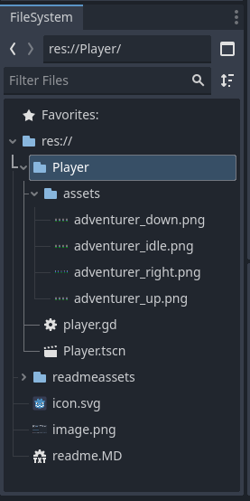

I've already started a new project, called Player. The first thing I'm going to do is create a new folder called "Player" in the file system. This sub folder gives me the ability to easily move components from one project to another and keeps objects from name conflicts. When I move this component into another game, I'll create a "Player" folder in that game and copy the objects from my "Player" folder there. Now, I probably wouldn't have 2 objects named "Player" in a game, but I might have two objects with the same name sometime in a complex game. 

Great, so the "Player" folder is there, now lets start creating the "Player" itself! Right click on the "Player" folder, select "Create New" and "Scene." This will open the new scene dialog. Change the Root Type to "CharacterBody2D," enter the Scene Name as "Player" and click "OK." This will create an empty scene with the CharacterBody2D as the base object.

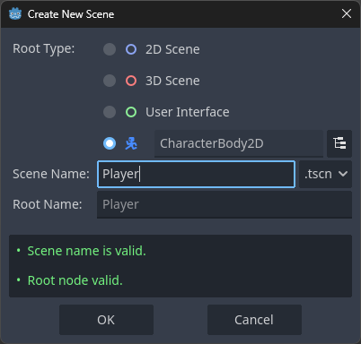

You'll notice in the Scene window that there is a yellow triangle that is warning you that there is no shape added to the CharacterBody2D to deal with collisions. By the end of this session, we'll have that addressed.

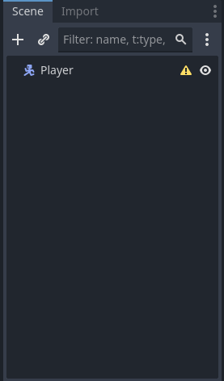

Let's go ahead and add a few other Godot Nodes to our Player. Specifically, we're going to add AnimatedSprite2D, to play animations, CollisionShape2D, to detect collisions, Label, to display some text, and Camera2D, to follow the player around when our game world is bigger than our window. Right click on the Player in the scene window click on "Add Child Node" and add these three nodes. Your Player Scene should look like this at the end.

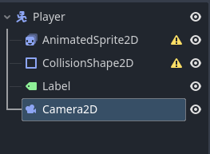

Notice that the Yellow warning is now gone on the CharacterBody2D, but it now exists on the AnimatedSprite2D and CollisionShape2D. We'll get to fixing those shortly! Let's start filling in our Player object with details.

The first thing we're going to do is to add in the animated sprites for the Player movement. We want to show these when the Player moves on the screen. I've placed my assets into the "Player/assets" folder. Again, this allows me to move this component and not worry about naming conflicts for other components.

Click on the AnimatedSprite2D in the Scene browser. In the Inspector, you'll see Sprite Frames as an option in the AnimatedSprite2D section. Click the dropdown and select "Sprite Frames." Click on the text entry for "Sprite Frames" again and it will open the "Animation" window at the bottom.

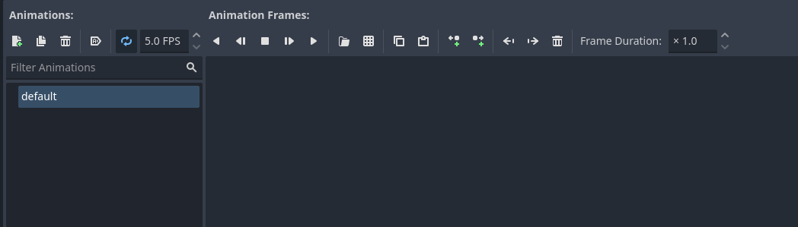

Now we are going to add animations for the player, specifically to move up, down, walk, and idle. Notice there isn't a left and right - that's because we'll use a trick with the images for walk to do both left and right! First, let's get the named animations in. Double-click on default and rename it "idle." Then, click the "Add" button and add the animations for up, down, and walk individually. You will rename the "New Animations" by double clicking on them and typing the name you want. Your Animation window should look like this at the end.

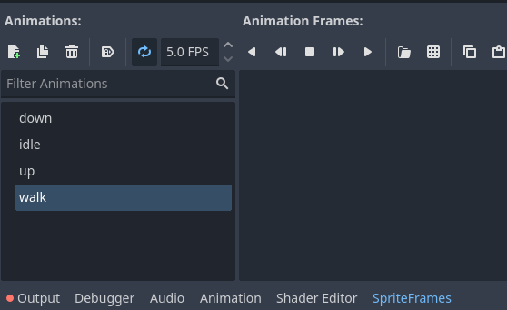

In this next step, we will add the assets for the animations. My assets are sprite sheets that need to be separated out into frames. Luckily, Godot supports sprite sheets and this process will be fairly easy! Let's walk through "down" in detail.

Click on the "Add Frames from Sprite Sheet" button in the Animation Frames section.

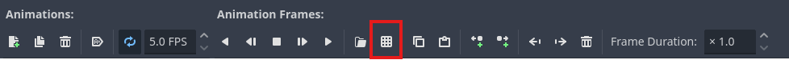

Next, navigate to the "Player/assets" folder and select the `adventurer_down.png` file. This will bring up a window where we can select frames. If you use my image, you can enter in 4 Horizontal frames and 1 Vertical frame to slice the image. Then, select each of the "frames" by clicking on it, starting from the left and going right. The dialog should look like this.

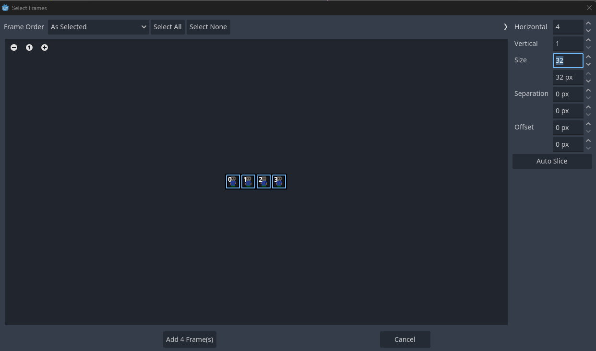

Click on the button that reads "Add 4 Frame(s)" and the images should be added to the animation window like this.

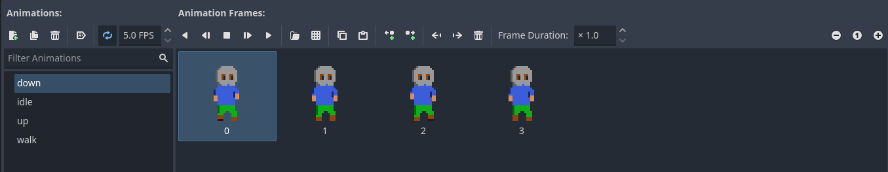

Now repeat this same process for the other 3 animations, using `adventurer_idle.png` for "idle," `adventurer_right.png` for "walk," and `adventurer_up.png` for "up." For "right," you will need to change the frames to 5 Horizontal and 1 Vertical and select all 5 frames.

The player might look a little small when loaded. We can do a quick fix on that. Select the "AnimatedSprite2D" node in your scene browser, go into the "Transform" section of the inspector and set the scale to 2 for x and 2 for y. If you have these linked, you should only have to change it for x and it will also change for y.

---
**NOTE**

I did not set the Texture Filters to "Nearest" in Build1. You can add this by clicking o the AnimatedSprite2D object, checking the Inspector under Canvas Item, and changing the value for Texture -> Filter to "Nearest." This value is set in Build2. Thank you OkMonk6021!

---

Next, we will update the CollisionShape2D object. Select it in the Scene Browser. The CollisionShape2D needs a shape that works with the AnimatedSprite2D shape. This will help your collisions seem more accurate to players when they play your game. In the Inspector, click on the down arrow by "Shape" and select "RectangleShape2D."

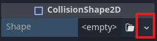

When you do, a rectangle will appear over the Player. Resize and move the rectangle, as needed, so that it covers the player like this.

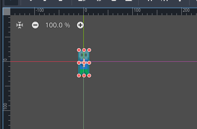

One last thing before we add some code and try this out is to add text to the label to call this "Player." Click on the Label in the Scene browser. In the Inspector window, enter "Player" in the Text field. Finally, move the label in the Scene browser so that it looks like this.

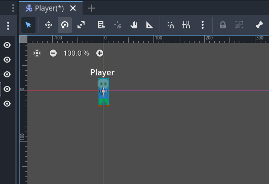

We are down to two last steps for this version of this component. We still need to add the input map for the project so we can test this and, also, a bit of code so we can see the Player move around. Let's take care of the input map first.

Open the Project Settings dialog by selecting the "Project -> Project Settings..." menu. Click on the "Input Map" tab so we can add new actions. We're going to add actions to move the player "up," "down," "left," and "right" using the arrow keys (or WASD, if you want) and left joystick controller (if you don't have a controller, you can skip this part). Here are the steps for "up" and you can repeat these for the other directions.

Type in "up" for the action and click on the +Add button. This will add the "up" action to the Input Map.


Next, click the "+" next to "up" to open a dialog to add events that can trigger "up" to occur. This dialog box listens for input, making it easy to add the keys. Press the up arrow or W key to add it


Click the "+" again and now press the left joystick on your controller up to assign it to up, as well

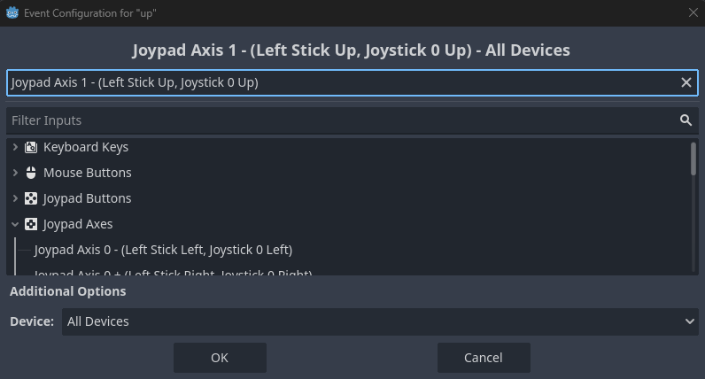

Repeat this process for "down," "left," and "right." The final output should look like this:

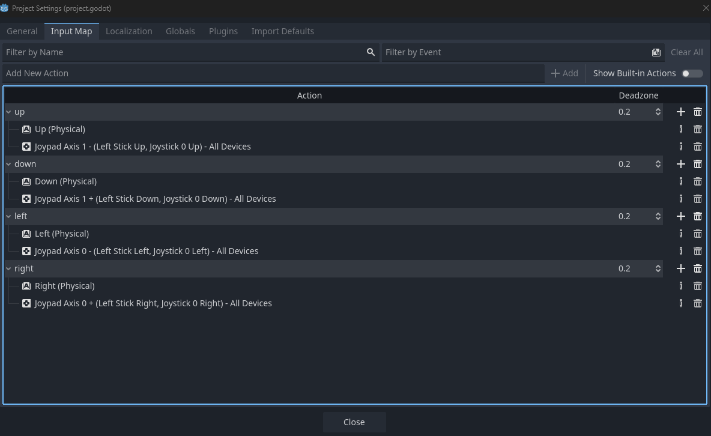

Click the "Close" button to return to the project.

For the final step, we're going to add some very basic code to the Player. To add code to the Player, click the Player in the Scene browser and click the "Add a new or existing script to the selected node" button.

Accept the defaults for the new script and the code browser window should appear. Replace what is in the code browser with the script below.

```
extends CharacterBody2D
class_name player_2d_body

var SPEED = 600

func _process(_delta: float) -> void:
    var x_direction: float = Input.get_axis("left", "right")
    var y_direction: float = Input.get_axis("up", "down")
    if x_direction:
        velocity.x = x_direction * SPEED
    else:
        velocity.x = move_toward(velocity.x, 0, SPEED)
    if y_direction:
        velocity.y = y_direction * SPEED
    else:
        velocity.y = move_toward(velocity.y, 0, SPEED)
        
    if velocity.x != 0:
        $AnimatedSprite2D.animation = "walk"
        $AnimatedSprite2D.flip_v = false
        $AnimatedSprite2D.flip_h = velocity.x < 0
    elif velocity.y < 0:
        $AnimatedSprite2D.animation = "up"
    elif velocity.y > 0:
        $AnimatedSprite2D.animation = "down"
    else:
        $AnimatedSprite2D.animation = "idle"
    $AnimatedSprite2D.play()
    
    move_and_slide()
```

This code will run within the Player class and look for the inputs we defined in the prior step. When the events are triggered, floats are sent to the variables that are then calculate the velocity of the CharacterBody2D. We want a gliding motion, so `move_toward` is used to allow the Player to gradually slow down. It's a pretty quick slow down with this component right now.

After the velocity is calculated, the animation is selected. If the Player is walking right or left, the "walk" animation is used. If they are moving left, the images are flipped horizontally to show the animation moving left. Finally, `move_and_slide()` is called to move the body based on the velocity.

If you want, you can play this scene using the F6 key. Note that the Player animations play but the Player doesn't move around the screen. This is because of the Camera2D node keeping the player in the middle of the screen. You can override this setting by clicking the "Override the in-game camera" button. Because there is no game world for this component, your Player is allowed to move off the screen and back onto it!


## Part 2 - Build the World and Integrate Player

**This build is in Godot 4.5.1 and uses the World project**

[World Project](https://github.com/timjbruce/godotbitesized_world)

Building the World is going to be similar to the build of the Player - _very basic_. This is about a 4 minute project, minus the reading. It's going to contain a world scene and a script that is used to handle global requirements. We'll also copy the Player Build 1 component into this world to see how the two interact. As a note, we're going to paint the player in for this first build. In future builds, we're going to instantiate. Why? I'm keeping the lessons short and sweet so we can see progress and move things along.

At the end of this build, your Scene and FileSystem windows will look like this and you'll have a player moving around in a world!

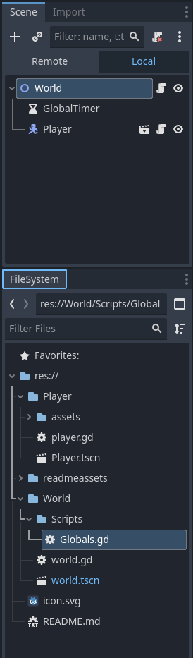

Now, let's start!

The first thing we're going to do is in the scene window, and select the 2D Scene object under "Create Root Node."

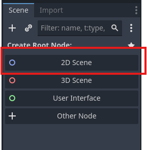

Double Click on the "Node2D" in your Scene window and rename it "World," like so.

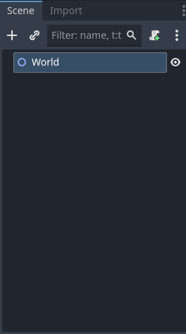

Now, we're going to add a timer node to the world scene. We don't have a use for the timer as of yet, but I like to add one if I know I'm going to use it (**hint:** we will!). After you add it, double click the Timer and rename it "GlobalTimer." Your scene should look like this.

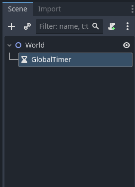

Now, let's save the scene. We're going to create a folder under the project called "World" first. This is used to keep all the assets for the world in one directory, so we can add in our other components over time and not have any overlap. Your FileSystem window will look similar to this.

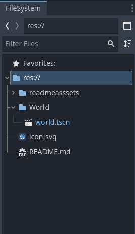

Next, copy the "Player" folder from our Player project into the project. You'll need to do this in Explorer, Command Prompt, Finder, whatever on your system. When you expand "Player" folder, your FileSystem window should look like this.

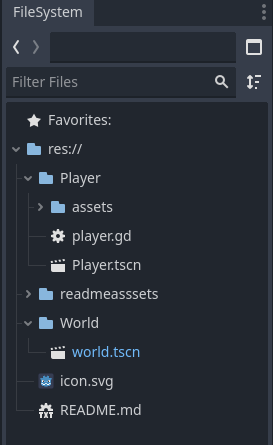

Now, we will select the "Player.tscn" file (the `Player` scene) from the FileSystem and drag it up to the `World` node in the `World Scene` window. This will drop the "Player" component into the world and make it a child of the `World` node.

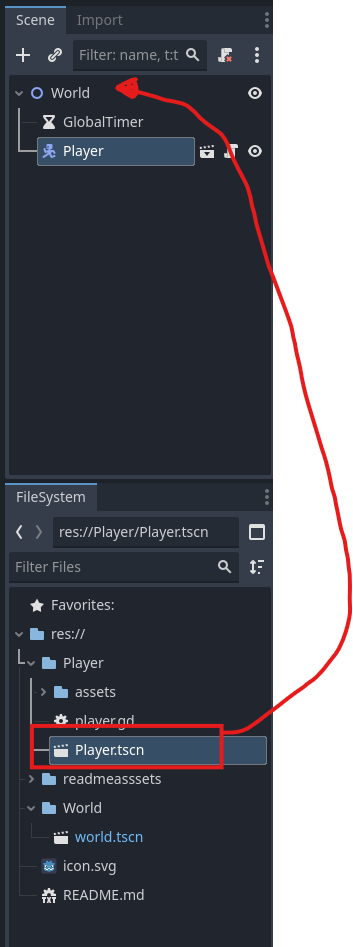

Finally, we need to repeat some steps from the "Player" build to add the input map for the project so we can test this. Let's take care of the input map!

Open the Project Settings dialog by selecting the "Project -> Project Settings..." menu. Click on the "Input Map" tab so we can add new actions. We're going to add actions to move the player "up," "down," "left," and "right" using the arrow keys (or WASD, if you want) and left joystick controller (if you don't have a controller, you can skip this part). Here are the steps for "up" and you can repeat these for the other directions.

Type in "up" for the action and click on the +Add button. This will add the "up" action to the Input Map.

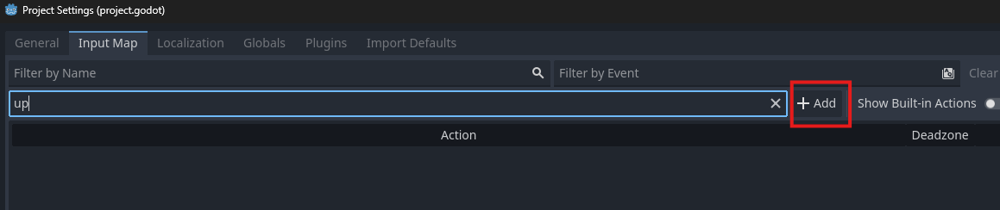

Next, click the "+" next to "up" to open a dialog to add events that can trigger "up" to occur. This dialog box listens for input, making it easy to add the keys. Press the up arrow or W key to add it

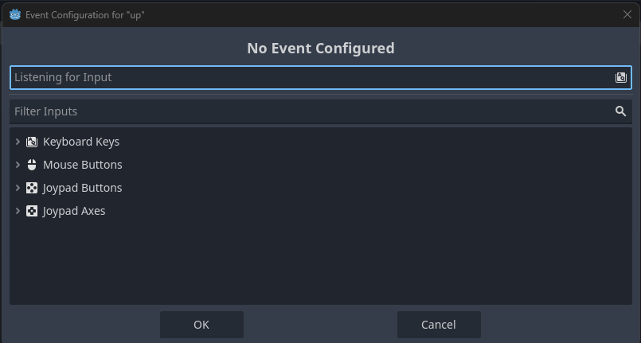

Click the "+" again and now press the left joystick on your controller up to assign it to up, as well


Repeat this process for "down," "left," and "right." The final output should look like this:


Click the "Close" button to return to the project.

Finally, we're going to add a bit of code to this solution. We're going to create a `Globals` script that will, initially, be pretty sparse. The `Globals` script will eventually allow us to track the different objects with simpler names. It will also allow us to listen for signals that we will be using. In future builds, we aren't going to "paint" objects in. We might want different numbers of enemies. When enemies die, they might drop loot. All of these dynamic items can be hard to track when an object is ready for other objects to subscribe to signals. We're not quite at the point to worry about this functionality, but we want to setup the framework that allows us to manage it now.

You might be asking why do this in a script instead of the `World` node. My simple answer is that this script can be available from all over. There might be a case where you want to do something that doesn't fall within the scope of the `World` node. This separation gives a lot more flexibility should that need arise and saves time from refactoring down the road.

We're going to start by creating a new folder under the `World` folder called `Scripts`. Right click on "World" in the FileSystem, choose "Create New" and  "Folder,"  set the name of the new folder to "Scripts," and click "OK." Your FileSystem window should look like this at the end.

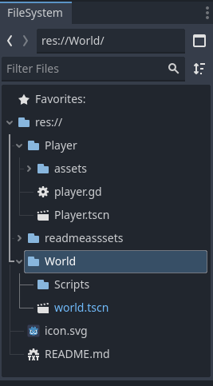

Next, we'll add the script. Right click on the `Scripts` folder in the FileSystem window, choose "Create New" and "Script," change the name to `Globals.gd`, and click "Create." Your FileSystem window should look like the below.

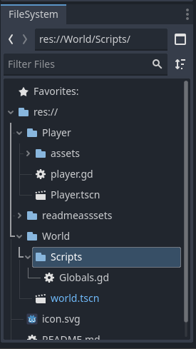

Double-click the script to open it up and copy the following code into the file and save it. You'll note that we're just using it, initially, to capture the nodes for `World`, `GlobalTimer`, and `Player`. These shortcuts allow us to access the objects using a notation of `Globals.object` instead of the `$Tree` notation. This can make a lot of work easier in the future. I know I could have accessed the variables directly in setting these values, but I prefer using setters instead of setting values directly, just in case there is some specific logic I want to see in the setting/storing of a variable. 

```
extends Node

var world: Node2D
var player: player_2d_body
var global_timer: Timer


func set_world(inc_world: Node2D) -> void:
    world = inc_world
    
func set_player(inc_player: player_2d_body) -> void:
    player = inc_player
    
func set_global_timer(inc_timer: Timer) -> void:
    global_timer = inc_timer
```

Now that we have a `Globals` script, we need to add it to the project so that we can access it as such. Select the "Project," "Project Settings" menu. Once there, click on the "Globals" tab. Type `res://World/Scripts/Globals.gd` in the "Path" field and make sure `Globals` is in the "Node Name" field. Click the "+Add" button and the script should be added to the window like so.

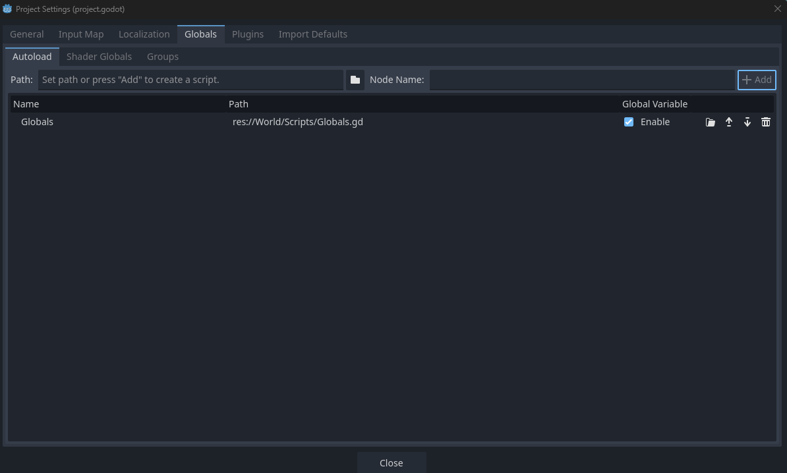

Click on "Close" to return to the project.

Last step before we test! We're going to add a small script to the `World` node to use the Globals script. This isn't necessary at this step, but let's do this to make sure the Globals works.

In the "Scene" window, make sure the `World` node is selected and click the "Add new script" button.

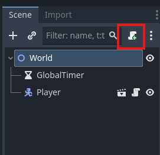

Click the "Create" button and the code editor should open the `world.gd` script in the code editor. We're going to use the simple code below to just set the variables that we created in the `Globals` area with the set_x commands. Paste this code into the world.gd file and save it.

```
extends Node2D

func _ready() -> void:
    Globals.set_world($".")
    Globals.set_player($Player)
    Globals.set_global_timer($GlobalTimer)
```

Now we're going to press F5 to run the game. Since we haven't selected a main scene yet, Godot will ask for the main scene. You should have the "World" scene open right now, so you can click on "Select Current." If you do not have it open, click on the "Select" button, navigate to the "world.tscn" file in your project, and click "Open."

Your window should now have the "World" scene running in your game and you should see a Player idle in the game. Just like with the "Player Build 1" project, you won't see the player move around as you use the keys or joystick due to the camera. You can override this setting by clicking the "Override the in-game camera" button. Because there is no game world for this component, your Player is allowed to move off the screen and back onto it!

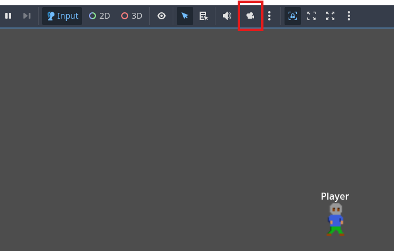

## Part 3 - The Generator
**Part 3 is in Godot 4.5.1 and uses the Generator Project**

[Generator Project](https://github.com/timjbruce/godotbitesized_generator)

For this build, we're building a single node object that will be used by Worlds to procedurally create, eventually, a floor/level for a 2D game. The first version is going to create a single room. This will also be the first object that starts to expose variables that can be used by the World to change the size of the object. When you get done with this build, your Scene and FileSystem windows should look similar to this.

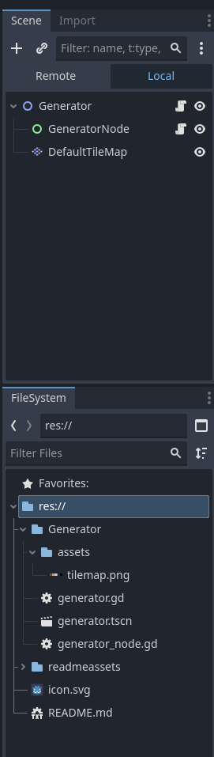

#### Starting the Scene

Let's start with a new project in Godot. In the Scene window, select "Node 2D." This is going to be the base node for our Generator. 


Rename the base node as "Generator."

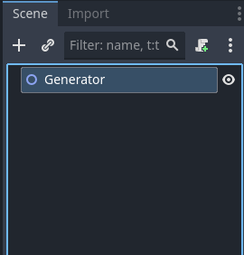

Next we'll add a Control Node to the scene. Click the + and search for the "Control" node. Control nodes are the base UI classes in Godot and give us a lot of flexibility for building, in this case, a dynamically sized room. Click the "Create" button to move into the scene paint mode.

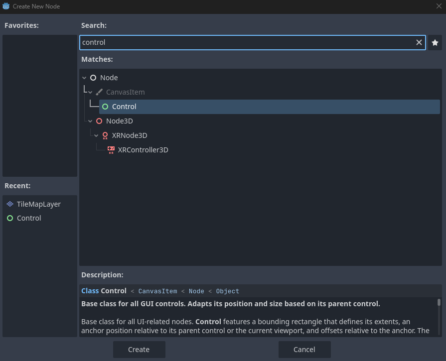

Next, let's rename the `Control` node to `GeneratorNode` by double-clicking it and typing in the new name.


Let's save the `Generator` scene now into the "Generator" folder. When you click save, create a new folder called "Generator" and save the `Generator` scene there as "generator.tscn." Your FileSystem window should look like this.

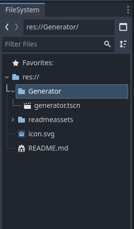

### Adding a Default Tile Map

In the Generator scene, we're going to add a default TileMapLayer for the Generator to use. This is going to be used for testing and in case one isn't added at the world level.

Click on the "Generator" node in the Scene window and click the + button to open the "Create New Node" dialog window.

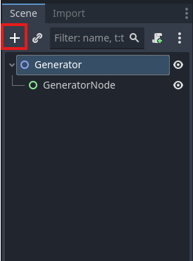

Search for the "TileMapLayer," select it, and click the "Create" button to add it to the scene.

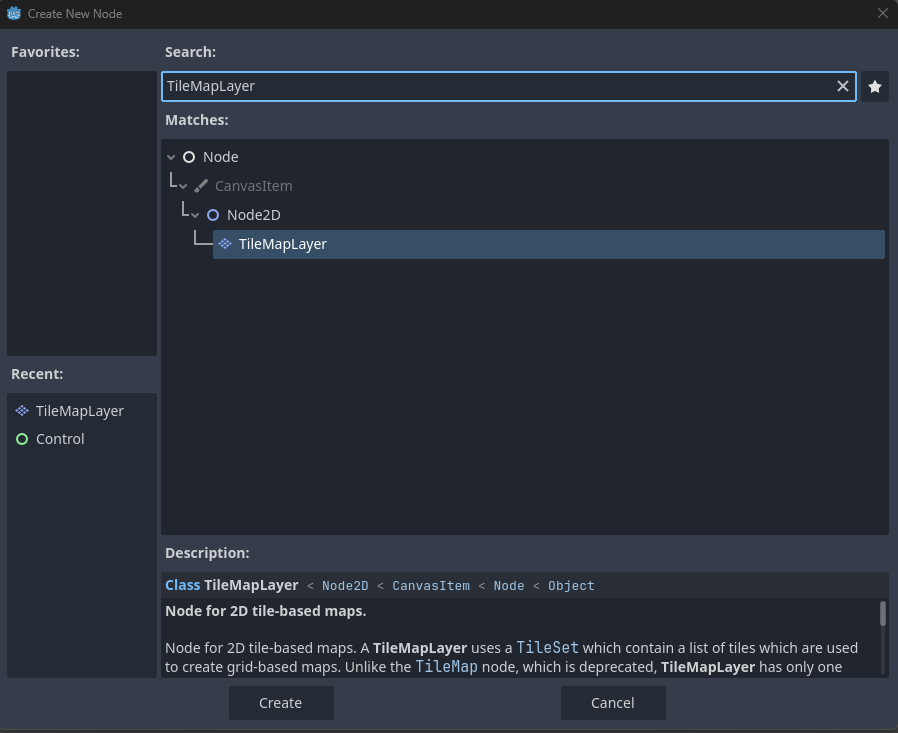

And let's rename the TileMapLayer to "DefaultTileMap." Double-click on the TileMapLayer and type the new name as so.

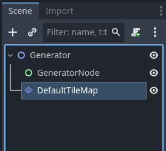

Now for the part that is going to take a bit, building the default tile map. You're probably going to replace this tilemap with every new game world you build, but this is good for testing updates to your Generator without having to import and setup a new graphic or take this generator and put it into a game world. 

Start by making sure your DefaultTileMap is selected in the Scene window. The next set of steps will be in the Inspector window. Click on the down arrow by the "Tile Set" field.

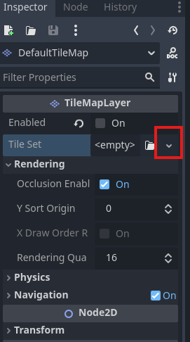

Next, click on the words "TileSet" in the Tile Set field. This will open options for the TileSet itself. See below for where to click.

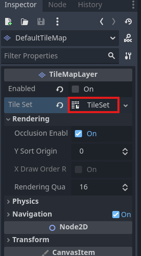

The first thing we're going to do with the TileSet is to add a Physics layer. Nothing else, right now, in our components or World has a physics layer. We specifically want to add this, as we're going to build walls with this Generator and the Player shouldn't be able to move beyond the walls. Even with this added layer to the Generator, the Player will be able to move beyond the walls, but we can fix that with the next Player build!

Click on the "Physics Layers" section in the TileSet to open it up. Click on "+Add Element." Now, change the "Collision Layer" so that nothing is selected and the "Collision Mask" so that only "2" is selected, as so.


Next, we will add in "Terrain Sets" by clicking that header in the same TileSet. We will then click the "+Add Element" button to open our first terrain set, as so.


Now, click on the "Terrains" sub heading.


Now that we have the terrain open, you're going to click "+ Add Eelement" for the Terrain four times. I know there's a lot of "+Add Elements" here - make sure you click the right one!


Your Inspector window should now look like this:


Lastly, for the terrain sets, let's rename each of them to "Wall," "Floor," "Filler," and "Exit" from the top down. The result should look like the below.


This last bit of the TileSet has a few steps. There is an asset in the repo located at /Generator/assets/tilemap.png. You'll want to copy that or make your own asset to use for this part. When the DefaultTileMap is selected, you should see a painting area that is opened at the bottom of your window, assuming you use the defaults, that looks like this.


Click on the "TileSet" at the bottom of that window. That will open a new view for us to use the asset mentioned above.


Now, select and drag your tilemap.png file to the "Tile Sources" field in the new painting window.


You should now see a dialog that your atlas was updated. Go ahead and click "Yes" to auto create the tiles.


Now we need to create the Terrain tiles that will be used by the Terrain Layers that we created above. We'll open the setup window first by double-clicking on the tilemap in the Tile Sources field.


Edit the ID value to "0" by clicking the "Edit" button and updating the value in the dialog to "0." Click "OK" when you've done this.


Change the name of the Tile Source to "Default."


Now, we're going to click on "Paint" and use that to setup our terrain tiles and physics layer 0.


Under "Paint Properties," select the "Terrains" option.


Select Terrain Set 0 in the Terrain Set field and Wall in the Terrain field.


Click in the middle of the upper left dark brown box in the tile map. A faint brown box should now be selected in it.


Now set the Floor, Filler, and Exit terrains the same way, using the middle of the upper left box. The colors should be light brown for Floor, blue for Filler, and black for Exit. The result should look like this.


Next, select the Physics Layer 0 value in the Paint Properties field and select the top left brown tile.


Save your scene here. The end is now in sight!

### Adding Code to the Generator and GeneratorNode

**This part uses the World Project**

[World Project](https://github.com/timjbruce/godotbitesized_world)

Now, we're going to add a script to the `Generator` by selecting the "Generator" node and clicking the "Attach new or existing script to the selected node" button.

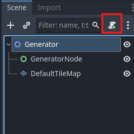

Use the default values in the window and click "Create" to add the script. This will open the code editor.

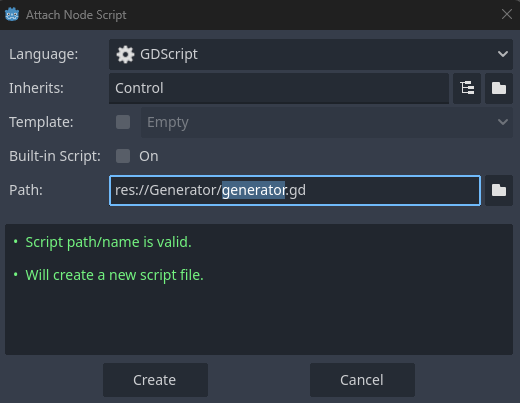

In the code editor, we're going to place the following code

```
extends Node2D
class_name Generator

@export var min_room_width: int = 3
@export var min_room_height: int = 3
@export var max_room_width: int = 500
@export var max_room_height: int = 500
@export var game_width: int = 1600
@export var game_height: int = 1200
@export var tile_map_layer: TileMapLayer = null
@export var draw_outline: bool = false


signal floor_generated
signal floor_is_cleared


func _ready() -> void:
    $GeneratorNode.initialize(min_room_width, min_room_height, max_room_width, max_room_height, game_width,
        game_height, tile_map_layer, draw_outline)
    if get_parent().name == "root":
        $GeneratorNode.generate()
        floor_generated.emit()


func generate() -> void:
    $GeneratorNode.generate()
    floor_generated.emit()


func clear_floor() -> void:
    $GeneratorNode.clear_floor()
    floor_is_cleared.emit()

```

This code acts as a wrapper for the GeneratorNode, as it is the root object of the scene. It takes in the default values and will set them for the GeneratorNode to use when generating a room. It will also take it a "TileMapLayer" that can be used to define what tiles should be used as "Floor," "Wall," "Filler," and "Exit." When these values are filled in and "generate" is called, the random room will appear in the game world, once we add that code to the GeneratorNode. There is also a signal for "floor_generated," which can be used to signal other tasks that might require the floor to be in place before taking action.

There is also a "clear_floor" function, which is used to clear out the assets for the existing floor, which also sends out the signal that the floor is cleared. This can be used to track the state of the floor for the game world.

These signals are being added in advance. Right now, nothing in our current "World" cares about the state of the floor. In the future, however, you will add in code to generate the player, enemies, objects, loot, and whatever you can come up with. If you have objects that create these types of items, they can subscribe to these signals to take appropriate actions.

Next, we will add script to the GeneratorNode object. Click the GeneratorNode object and click the "Attach new or existing script to the selected node" button.

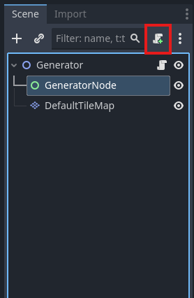

```
extends Control
class_name GeneratorNode

var min_room_width: int = 3
var min_room_height: int = 3
var max_room_width: int = 500
var max_room_height: int = 500
var game_width: int = 1600
var game_height: int = 1200
var tile_map_layer: TileMapLayer = null
var draw_outline: bool = false

var wall_vector: Vector2i
var floor_vector: Vector2i
var filler_vector: Vector2i
var exit_vector: Vector2i

var room_listing: Dictionary


func clear_floor() -> void:
    room_listing = {}
    tile_map_layer.clear()


func generate() -> void:
    var grid: Dictionary = {Vector2i(0,0): {"x_start": 0, "y_start": 0}}
    room_listing = _generate_room(grid)
    _draw_rooms()


func initialize(inc_min_room_width: int, inc_min_room_height: int, inc_max_room_width: int, inc_max_room_height: int,
                inc_game_width: int, inc_game_height: int, inc_tile_map_layer: TileMapLayer, inc_draw_outline: bool) -> void:
    min_room_width = inc_min_room_width
    min_room_height = inc_min_room_height
    max_room_width = inc_max_room_width
    max_room_height = inc_max_room_height
    game_width = inc_game_width
    game_height = inc_game_height
    tile_map_layer = inc_tile_map_layer
    draw_outline = inc_draw_outline
    _get_main_tiles()

func _ready() -> void:
    pass
    
    
func _get_main_tiles() -> void:
    var terrains = {}
    for terrain in tile_map_layer.tile_set.get_terrains_count(0):
        terrains[str(terrain)] = tile_map_layer.tile_set.get_terrain_name(0,terrain)
    var source = tile_map_layer.tile_set.get_source(0)
    #check every tile to find its terrain
    for tile in source.get_tiles_count():
        var tile_data = source.get_tile_data(source.get_tile_id(tile), 0)
        if tile_data.terrain != -1:
            match terrains[str(tile_data.terrain)]:
                "Wall":
                    wall_vector = source.get_tile_id(tile)
                "Floor":
                    floor_vector = source.get_tile_id(tile)
                "Filler":
                    filler_vector = source.get_tile_id(tile)
                "Exit":
                    exit_vector = source.get_tile_id(tile)


func _generate_room(grid_location) -> Dictionary:
    var room: Dictionary = {}
    for item in grid_location:
        room["x"] = randi_range(grid_location[item]["x_start"], 
            grid_location[item]["x_start"])
        room["y"] = randi_range(grid_location[item]["y_start"], 
            grid_location[item]["y_start"])
        room["width"] = randi_range(min_room_width, max_room_width - (room["x"] - grid_location[item]["x_start"]))
        room["height"] = randi_range(min_room_height, max_room_height - (room["y"] - grid_location[item]["y_start"]))
    return room


func _draw_rooms() -> void:
    if draw_outline:
        for x in range(0, game_width):
            if x % 25 == 0:
                tile_map_layer.set_cell(Vector2i(x,0), 0, floor_vector)
            else:
                tile_map_layer.set_cell(Vector2i(x,0), 0, filler_vector)
        for y in range(0, game_height):
            if y % 25 == 0:
                tile_map_layer.set_cell(Vector2i(0,y), 0, floor_vector)
            else:
                tile_map_layer.set_cell(Vector2i(0,y), 0, filler_vector)

    for x in range(room_listing["x"], (room_listing["x"] + room_listing["width"] + 1)):
        for y in range(room_listing["y"], (room_listing["y"] + room_listing["height"] + 1)):
            if x == room_listing["x"] || x == (room_listing["x"] + room_listing["width"]):
                tile_map_layer.set_cell(Vector2i(x,y), 0, wall_vector)
            elif y == room_listing["y"] || y == (room_listing["y"] + room_listing["height"]):
                tile_map_layer.set_cell(Vector2i(x,y), 0, wall_vector)

```

This code will generate a random sized room using the min/max_room_width and min/max_room_height variables. There's also a flag to draw the outline for the full game world, should you need it for debugging.

### Almost ready to generate a room!

The last little bit that we need to do is to explore the properties of the Generator and how we can use them in a game. Click on the "Generator" in your scene and look at the Inspector to see what is exposed.


click on the Tile Map Layer field in the properties to open up a dialog to select a node to assign to the property. Click on the "DefaultTileMap" node and click "OK" to assign our Default Tile Map.


### Let's Test

Since this is the only scene, we're going to test using the F6 / Run Scene functionality of Godot. Make sure the Generator Scene is open in the Scene window and press F6. You should see a window something like the below open up. Try out different settings for the Generator in the Inspector window to set different room sizes.


## Adding the Generator to the World
**Build 2 is in Godot 4.5.1**

Now we're adding the Generator to the project and generating a room. The room will be more like something painted in, for the time being - the Player component does not have physics added to it. But, we are going to integrate the rendering. In the next couple of builds, we will add this functionality.

### Copy the Generator folder into the project

For the first step, copy the Generator component into your World project.


### Set Layer Names

Next, select the Project -> Project Settings menu. Navigate to the "Layer Names" section and click on "2D Render." Here, we're going to add the names of different nodes and the layer they will use. Enter "World" on Layer 1 and "Player" on Layer 3. Click "Close" when you are done.


### Update Globals.gd

Next, open the Globals.gd script. We're going to add in a variable and function to handle saving the generator. Add the following code at the bottom of the variable declarations.

```
var generator: Generator
```

And add the following function at the bottom of the file

```
func set_generator(inc_generator: Generator) -> void:
	generator = inc_generator
```

### Update the World scene

**This part uses the World Project**

[World Project](https://github.com/timjbruce/godotbitesized_world)

Next, open the World scene so that we can add the Generator to it. With the scene open, click and drag the `generator.tscn` file to the "World" node in your Scene window. Your scene should be updated to look like this:


Let's add some code to the the world.gd script. Open the script and add the following lines to the `_ready()` function.

```
	Globals.set_generator($Generator)
	Globals.generator.floor_generated.connect(_on_floor_generated)
	Globals.generator.floor_is_cleared.connect(_on_floor_cleared)
	Globals.generator.generate()
```

Also, add the following functions at the bottom of the file:

```
func _on_floor_generated() -> void:
	print("floor generated message received")
	

func _on_floor_cleared() -> void:
	print("floor cleared message received")
```

Your world.gd script should look like this:

```
extends Node2D

func _ready() -> void:
	Globals.set_world($".")
	Globals.set_player($Player)
	Globals.set_global_timer($GlobalTimer)
	Globals.set_generator($Generator)
	Globals.generator.floor_generated.connect(_on_floor_generated)
	Globals.generator.floor_is_cleared.connect(_on_floor_cleared)
	Globals.generator.generate()
	

func _on_floor_generated() -> void:
	print("floor generated message received")
	

func _on_floor_cleared() -> void:
	print("floor cleared message received")
```

Before we run this, we're going to make a small change to our Generator via the Inspector window. Click on the Generator in the Scene window and look at the Inspector window. We're going to change the Min Room Width and Min Room Height to 50. We're also going to update the Max Room Width and Max Room Heights to 75. Since these variables have been exported, we can make changes for the project we are working on without changing the code in the files. We will also turn on the "Draw Outline" setting. Your Inspector window should look like this.


### On to testing!

Run the game by pressing F5. Your game window should appear and look something like this


Move the player around to the right and down. You should see the size of your room that was drawn. You'll also see some blue lines, denoting the outside area for your game width and height.


Try out some other settings for the room generator and see how they work! Next, we'll add in some small changes to the generator, to select where the player starting location is, and to the player to keep the player from crossing the wall boundaries.

## Summary

Now we have a player added to a game world and a generator that is creating a room/map for us to start using. In the next section, we'll add physics capabilities to the mix.

[Next Lesson](lesson2.MD)