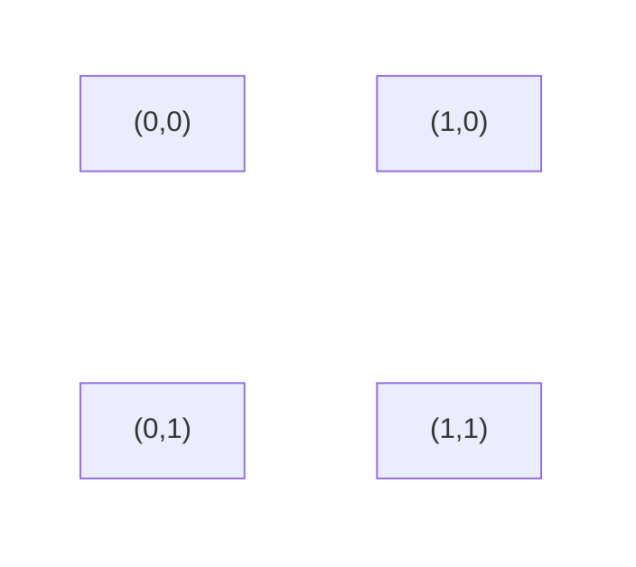
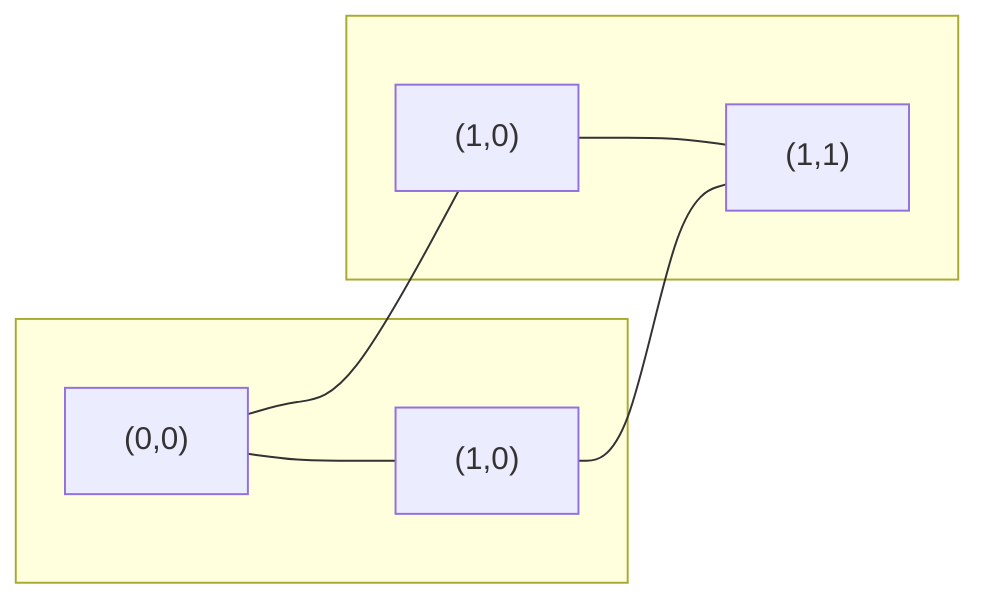
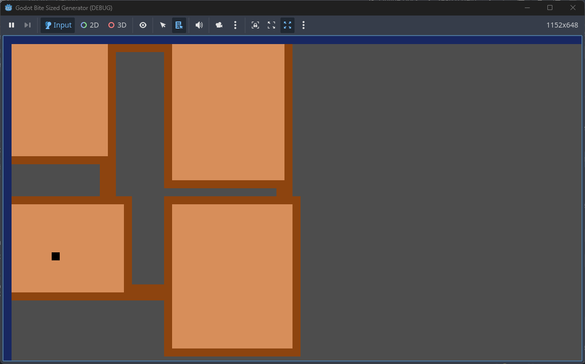

# Lesson 4 - Updating the Generator

In this lesson, we'll focus on extending the Genrator component. There are a lot of updates that will be in this one, namely better tilemap support, multiple room generation with hallways, 

**This section uses Godot 4.5.1 and the Player Project**

## Improving the Passing of Data

The first thing we are going to do is create a new class to handle passing data between objects. In a prior step, I had used individual variables and this approach can get unreadable in the IDE and hard to maintain. To improve this, we'll use a new class `GeneratorData` that extends `RefCounted`.

Create a new script in the Generator folder called `GeneratorData.gd`.

<details>
<summary>Full listing for GeneratorData.gd</summary>

```
class_name GeneratorData
extends RefCounted

var min_room_width: int
var min_room_height: int
var max_room_width: int 
var max_room_height: int
var game_width: int
var game_height: int
var tile_map_layer: TileMapLayer
var draw_outline: bool

func _init(inc_min_room_width, inc_min_room_height, 
		inc_max_room_width, inc_max_room_height, inc_game_width, inc_game_height, 
		inc_tile_map_layer, inc_draw_outline) -> void:
	min_room_width = inc_min_room_width
	min_room_height = inc_min_room_height
	max_room_width = inc_max_room_width
	max_room_height = inc_max_room_height
	game_width = inc_game_width
	game_height = inc_game_height
	tile_map_layer = inc_tile_map_layer
	draw_outline = inc_draw_outline
```

</details>

This class will allow us to have the benefits of autocompletion in the IDE while shortening the code that passes this data (1 variable instead of 8). You'll note that it only has an `_init` function in it, which is called when you use `.new()` to create a new object.

### Updating Generator to use GeneratorData and Get Random Location

This new class needs to be used by the `generator.gd` and `generator_node.gd` scripts. Let's start with the `generator.gd` script, where we only need to update the `_ready` function.

```
func _ready() -> void:
	var generator_data: GeneratorData = GeneratorData.new( 
		min_room_width, min_room_height, max_room_width, max_room_height,
		game_width, game_height, tile_map_layer, draw_outline)
	$GeneratorNode.initialize(generator_data)
	if get_parent().name == "root":
		$GeneratorNode.generate()
		print(get_player_start())
		floor_generated.emit()
```

We only need this object to read the property settings for the scene and pass them to the `GeneratorNode` to create the map. Therefore, we create a variable local to the function, instantiate and populate it with a call to `.new()` and then we pass it to the `GeneratorNode`.

We'll also add a function to get a random location on the floor, which we can use to place NPCs and enemies, as well as fixing a bug that returned a Vector2 for the Player Start:

```
func get_player_start() -> Vector2i:
	return $GeneratorNode.get_player_start()

func get_random_location() -> Vector2i:
	return $GeneratorNode.get_random_location()
```

### Updating GeneratorNode to use GeneratorData

Now we'll update `generator_node`. These changes are a bit more than the last updates. Before, we used class variables on the `generator_node` to save and use these values for the generation of a room/floor, so I'm including the full code at the end of this section. However, let's walk through some of the changes.

First, we removed all the data variables for the generator and replaced them with a single one.

```
var generator_data: GeneratorData = null
```

On initialize, we simply assign the single variable we get to the local class reference and start the work.

```
func initialize(inc_generator_data: GeneratorData) -> void:
	generator_data = inc_generator_data
	_get_main_tiles()
```

Now, every where else that we would reference the class variables, we need to change to `generator_data.class_variable`. This is a small change, but there are a number of spots. In this case, either update them in your own IDE or copy the code below as the full `generator_node.gd` file at the end of this section. I'm not putting the full function here, as there are other updates to the `GeneratorNode` class.

## Adding Better Support for Tilemaps

The first version of the Generator component used the `set_cell` method. `set_cell`, itself, isn't bad, but it is limiting. If you paint your scenes in the editor and don't use a generator like this, then you get the benefit of the engine figuring out how to place tiles so that they match the design that your are going for. With `set_cell`, you need to pick each tile, one by one and location by location, to build the map. This can be overly complex code that you would need to write and maintian. The fix for this is to use the `set_cells_terrain_connect` method.

`set_cells_terrain_connect` takes an array of Vector2i's, a terrain set id, a terrain id, and a flag to either ignore or pay attention to empty tiles. It then paints a pattern that makes sense based on more complex tilemaps than we used in the first example. This change only needs to occur in the `_draw_rooms` function that we've defined in the generator. What we'll do is collect an array of the locations that need to be painted for the outline, the room, and the wall and then call `set_cells_terrain_connect` at the very end of the function. The entire `_draw_rooms` function is listed below, where you can see / review these changes.

```
func _draw_rooms() -> void:
	var floors: Array[Vector2i] = []
	var walls: Array[Vector2i] = []
	var outline: Array[Vector2i] = []
	if generator_data.draw_outline:
		for x in range(0, generator_data.game_width):
			if x % 25 == 0:
				floors.append(Vector2i(x,0))
			else:
				outline.append(Vector2i(x,0))
		for y in range(0, generator_data.game_height):
			if y % 25 == 0:
				floors.append(Vector2i(0,y))
			else:
				outline.append(Vector2i(0,y))
	var x_start
	var x_end
	var y_start
	var y_end
	var pos: Vector2i

	for room in room_listing:
		for x in range(room_listing[room]["x"], (room_listing[room]["x"] + room_listing[room]["width"] + 1)):
			for y in range(room_listing[room]["y"], (room_listing[room]["y"] + room_listing[room]["height"] + 1)):
				x_start = room_listing[room]["x"]
				x_end = x_start + room_listing[room]["width"]
				y_start = room_listing[room]["y"]
				y_end = y_start + room_listing[room]["height"]
				pos = Vector2i(x, y)
				floors.append(pos)
				if x == x_start or x == x_end or y == y_start or y == y_end:
					walls.append(pos)
	generator_data.tile_map_layer.set_cells_terrain_connect(outline, 0, TileLayer.Filler)	
	generator_data.tile_map_layer.set_cells_terrain_connect(floors, 0, TileLayer.Floor, false)
	generator_data.tile_map_layer.set_cells_terrain_connect(walls, 0, TileLayer.Wall, false)
```

That first, simple tilemap was to get the framework started. Now, we want the ability to replace / update the tilemap with custom graphics for the game. It worked, and that was what mattered. Now, however, we want to modify it so that we can use it in a game with real graphics. Even better, we'll modify the generator so that we can use it in many games!

### Adding More Rooms

Using a single room is a pretty boring map. Yeah, you can create a very large room, but it is still boring. One of my old-school favorite games was Hack, where a player would get placed into a room on a floor and then explore that level to find hallways between rooms and, eventually, an exit. Hack placed rooms all over and had interesting hallways with turns. Instead of going to that level, I'm going to introduce a grid to the rooms. In each square of the grid, we'll create a room of a size based on the inputs to the generator. We'll also, if there are rooms next to, above, or below the room, connect the rooms with hallways. This isn't the level of Hack, but it will make for more interesting maps and placement of Enemies and NPCs!

To add more rooms, we're going to touch all of the generator scene's objects. Before we get into that, let's talk about how this idea will work.

First of all, we're going to go a simple route and place rooms in a grid fashion. This grid will be based on the maximum size of rooms, plus a minimum space between the rooms. The minimum space is to create hallways between rooms (if the value is > 0), or to allow rooms that just have doors into other rooms (if you set it to 0). The grid will be stored as locations for each of the rooms, in a rows and columns format. A 2 x 2 grid might look like this:



Next, for each spot in the grid, we'll generate a room. The room size will be based off a range of sizes that must allow for some level of overlap so we can connect rooms to horizontally and vertically. To do so, we'll manually calculate the minimum size of a room based on a value that is provided in the properties for the Generator. This value starts at 60% of maximum size and allows you to change it up to 100%. Using 60% guarantees at least 10% overlap between the rooms. The hallways height (for horizontal connections) and width (for vertical connections), will be calculated as `int((minimum overlap % - 50%) * (height or width))`. You may need to play around with these values to ensure your players, enemies, and NPCs can move between the rooms, or not, as your game dictates. The connected rooms might look like this:



### Changes for GeneratorData To Format the Rooms

Starting off, we'll change the `GeneratorData.gd` file to accept some new values and also do some calculations of data for us. We want to encapsulate the calculations in this class and do them one time so that we don't have to keep performing them.

<details>

<summary>GeneratorData Class Code</summary>

```
class_name GeneratorData
extends RefCounted

var rows: int
var columns: int
var min_space_between_rooms: int
var min_room_width: int
var min_room_height: int
var max_room_width: int 
var max_room_height: int
var game_width: int
var game_height: int
var tile_map_layer: TileMapLayer
var draw_outline: bool
var rooms: int
var hor_hallway_height: int
var ver_hallway_width: int

func _init(inc_rows, inc_columns, inc_min_space_between_rooms, 
		inc_min_room_width, inc_min_room_height, inc_max_room_width, 
		inc_max_room_height, inc_game_width, inc_game_height, 
		inc_tile_map_layer, inc_draw_outline) -> void:
	rows = inc_rows
	columns = inc_columns
	min_space_between_rooms = inc_min_space_between_rooms
	min_room_width = int(inc_min_room_width * inc_max_room_width)
	min_room_height = int(inc_min_room_height * inc_max_room_height)
	hor_hallway_height = int((inc_min_room_height - .5) * inc_max_room_height)
	ver_hallway_width = int((inc_min_room_width - .5) * inc_max_room_width)
	max_room_width = inc_max_room_width
	max_room_height = inc_max_room_height
	game_width = inc_game_width
	game_height = inc_game_height
	tile_map_layer = inc_tile_map_layer
	draw_outline = inc_draw_outline
	rooms = rows * columns
```

</details>

### Changes to generator.gd to Pass Values Properly

Next, we'll update the `generator.gd` file. We'll want to add some new property values and also ensure some values are passed in with the range that we expect, namely the minimum room size being between 60% and 100% of the maximum room size. We'll also add rows and columns, which will them be used to generate the room grid and the rooms. Below is the full set of `@export` variables for the class:

```
@export var rows: int = 3
@export var columns: int = 5
@export var min_space_between_rooms: int = 3
@export_range(.6, 1.0) var min_room_width: float = .6
@export_range(.6, 1.0) var min_room_height: float = .6
@export var max_room_width: int = 500
@export var max_room_height: int = 500
@export var game_width: int = 1600
@export var game_height: int = 1200
@export var tile_map_layer: TileMapLayer = null
@export var draw_outline: bool = true
```

Next, we'll update the `generator_data` initialization in the `_ready` function:

```
	var generator_data: GeneratorData = GeneratorData.new(
		rows, columns, min_space_between_rooms, 
		min_room_width, min_room_height, max_room_width, max_room_height,
		game_width, game_height, tile_map_layer, draw_outline)
```

### Updates for generator_node.gd

`generator_node.gd` has the most updates for this. First of all, we are going to update our variables to help us track what vectors need to use what tiles. We are also adding an Enum for the tile layers, so we can reference it in a smarter fashion.

```
var wall_vector: Array[Vector2i]
var floor_vector: Array[Vector2i]
var filler_vector: Array[Vector2i]
var exit_vector: Array[Vector2i]
var blocked_blocks: Array[Vector2i]
var wall_tile_quadrant_size: int = 0

var grid: Dictionary = {}
var room_listing: Dictionary = {}
var hallways: Dictionary = {}

enum TileLayer {
	Wall, Floor, Filler, Exit
}
```

Next, we need to change the `generate` function to create a grid for the floor, create a room for each grid location, connect the rooms, and then draw the rooms:

```
func generate() -> void:
	#create a grid that we can iterate around
	for x in range(0, generator_data.columns):
		for y in range(0,generator_data.rows):
			grid[Vector2i(x + 1, y + 1)] = {
				"x_start" : (x * (generator_data.max_room_width + generator_data.min_space_between_rooms)), 
				"y_start": (y * (generator_data.max_room_height + generator_data.min_space_between_rooms))}
	#create rooms for each location in the grid
	for location in grid:
		room_listing[location] = _generate_room(grid[location])
	#connect and draw the rooms
	_connect_rooms()
	_draw_rooms()
```

We also need to add a function to connect the rooms together by identifying overlaps between them, as our hallways will be only horizontal and vertical for the time being. We'll also use a helper function to add the hallways to an array:

```
func _connect_rooms():
	var left_1: int
	var right_1: int
	var top_1: int
	var bottom_1: int
	var left_2: int
	var right_2: int
	var top_2: int
	var bottom_2: int
	var left_start: int
	var right_end: int
	var top_start: int
	var bottom_end: int
	var connector: int
	var neighbor: Vector2i
	
	#location is stored as x = cols, y = rows
	for location in grid:
		if location.y < generator_data.rows:
			#need a connection down, or vertical hallway
			#find the overlap
			left_1 = room_listing[location]["x"]
			right_1 = room_listing[location]["x"] + room_listing[location]["width"]
			neighbor = Vector2i(location.x, location.y + 1)
			left_2 = room_listing[neighbor]["x"]
			right_2 = room_listing[neighbor]["x"] + room_listing[neighbor]["width"]
			if left_1 < left_2:
				left_start = left_2
			else:
				left_start = left_1
			if right_1 > right_2:
				right_end = right_2 - generator_data.ver_hallway_width
			else:
				right_end = right_1 - generator_data.ver_hallway_width
			connector = randi_range(left_start, right_end)
			for i in range(1, generator_data.ver_hallway_width):
				var value = Vector2i(connector + i, room_listing[location]["y"] + room_listing[location]["height"])
				blocked_blocks.append(value)
				value = Vector2i(connector + i, room_listing[neighbor]["y"])
				blocked_blocks.append(value)
			var height = room_listing[neighbor]["y"] - (room_listing[location]["y"] + room_listing[location]["height"])
			_add_hallway(connector, room_listing[location]["y"] + room_listing[location]["height"], generator_data.ver_hallway_width, height )
			room_listing[location]["bottom_connector_start"] = connector
			room_listing[location]["bottom_connector_end"] = connector + generator_data.ver_hallway_width
			room_listing[neighbor]["top_connector_start"] = connector
			room_listing[neighbor]["top_connector_end"] = connector + generator_data.ver_hallway_width
		if location.x < generator_data.columns:
			#need a connection to the right, or horizontal hallway
			top_1 = room_listing[location]["y"]
			bottom_1 = room_listing[location]["y"] + room_listing[location]["height"]
			neighbor = Vector2i(location.x + 1, location.y)
			top_2 = room_listing[neighbor]["y"]
			bottom_2 = room_listing[neighbor]["y"] + room_listing[neighbor]["height"]
			if top_1 < top_2:
				top_start = top_2
			else:
				top_start = top_1
			if bottom_1 > bottom_2:
				bottom_end = bottom_2 - generator_data.hor_hallway_height
			else:
				bottom_end = bottom_1 - generator_data.hor_hallway_height
			connector = randi_range(top_start, bottom_end)
			for i in range(1, generator_data.hor_hallway_height):
				var value = Vector2i(Vector2i(room_listing[location]["x"] + room_listing[location]["width"], connector + i ))
				blocked_blocks.append(value)
				value = Vector2i(room_listing[neighbor]["x"] ,connector + i )
				blocked_blocks.append(value)
			var width = room_listing[neighbor]["x"] - (room_listing[location]["x"] + room_listing[location]["width"])
			_add_hallway(room_listing[location]["x"] + room_listing[location]["width"], connector, width, generator_data.hor_hallway_height )
			room_listing[location]["right_connector_start"] = connector
			room_listing[location]["right_connector_end"] = connector + generator_data.hor_hallway_height
			room_listing[neighbor]["left_connector_start"] = connector
			room_listing[neighbor]["left_connector_end"] = connector + generator_data.hor_hallway_height


func _add_hallway(x: int, y: int, width: int, height: int) -> void:
	var hallway_len: int = len(hallways) + 1
	hallways[str(hallway_len)] = {"x": x, "y": y, "width": width, "height": height}
```

We will also update the `_draw_rooms` function to iterate over the rooms and collect all the tiles that need to be painted and then paint them appropriately. We're also adding a call to get an exit location near the end of `_draw_rooms` that will be added shortly.

```
func _draw_rooms() -> void:
	var floors = []
	var walls = []
	var fillers = []
	if generator_data.draw_outline:
		for x in range(0, 1600):
			fillers.append(Vector2i(x,0))
		for y in range(0, 1200):
			fillers.append(Vector2i(0,y))
	for room in room_listing:
		for x in range(room_listing[room]["x"], (room_listing[room]["x"] + room_listing[room]["width"] + 1)):
			for y in range(room_listing[room]["y"], (room_listing[room]["y"] + room_listing[room]["height"] + 1)):
				if x == room_listing[room]["x"] || x == (room_listing[room]["x"] + room_listing[room]["width"]):
					if not blocked_blocks.has(Vector2i(x, y)):
						walls.append(Vector2i(x,y))
				elif y == room_listing[room]["y"] || y == (room_listing[room]["y"] + room_listing[room]["height"]):
					if not blocked_blocks.has(Vector2i(x, y)):
						walls.append(Vector2i(x,y))
				else:
					floors.append(Vector2i(x,y))
	for hall in hallways:
		for x in range(hallways[hall]["x"], (hallways[hall]["x"] + hallways[hall]["width"] + 1)):
			for y in range(hallways[hall]["y"], (hallways[hall]["y"] + hallways[hall]["height"] + 1)):
				if x == hallways[hall]["x"] || x == (hallways[hall]["x"] + hallways[hall]["width"]):
					if not blocked_blocks.has(Vector2i(x, y)):
						walls.append(Vector2i(x,y))
				elif y == hallways[hall]["y"] || y == (hallways[hall]["y"] + hallways[hall]["height"]):
					if not blocked_blocks.has(Vector2i(x, y)):
						walls.append(Vector2i(x,y))
				else:
					floors.append(Vector2i(x, y))
	exit_vector.append(get_random_location())

	floors = floors + blocked_blocks
	
	generator_data.tile_map_layer.z_index = 
    generator_data.tile_map_layer.set_cells_terrain_connect(fillers, 0, TileLayer.Filler, false)	
	generator_data.tile_map_layer.set_cells_terrain_connect(walls, 0, TileLayer.Wall, false)
	generator_data.tile_map_layer.set_cells_terrain_connect(floors, 0, TileLayer.Floor, false)
	generator_data.tile_map_layer.set_cells_terrain_connect(exit_vector, 0, TileLayer.Exit, false)

```

The `get_player_start` function will be updated to select a location in the upper left hand room (quadrant 0,0) for start. We'll also need a function to place enemies and NPCs around the floor. To help, we'll create a helper function to get a random location that can be called by both of these.

```
func _get_location(room: Vector2i) -> Vector2i:
	var loc_x = randi_range(room_listing[room]["x"] + 3, room_listing[room]["x"] + room_listing[room]["width"] - 3)
	var loc_y = randi_range(room_listing[room]["y"] + 3, room_listing[room]["y"] + room_listing[room]["height"] - 3)
	return Vector2(loc_x, loc_y)


func get_player_start() -> Vector2i:
	return _get_location(Vector2i(1, 1))

		
func get_random_location() -> Vector2:
	var room = room_listing.keys()[randi() % room_listing.size()]
	return _get_location(room)	
```

If we run the generator, using F6, with 2 columns, 2 rows, maximum room height and width of 20, you might get a result like below:



<details>

<summary>Full generator_node.gd</summary>

```
extends Control
class_name GeneratorNode

var generator_data: GeneratorData = null

var wall_vector: Array[Vector2i]
var floor_vector: Array[Vector2i]
var filler_vector: Array[Vector2i]
var exit_vector: Array[Vector2i]
var blocked_blocks: Array[Vector2i]
var wall_tile_quadrant_size: int = 0

var grid: Dictionary = {}
var room_listing: Dictionary = {}
var hallways: Dictionary = {}

enum TileLayer {
	Wall, Floor, Filler, Exit
}

func clear_floor() -> void:
	room_listing = {}
	generator_data.tile_map_layer.clear()


func generate() -> void:
	#create a grid that we can iterate around
	for x in range(0, generator_data.columns):
		for y in range(0,generator_data.rows):
			grid[Vector2i(x + 1, y + 1)] = {
				"x_start" : (x * (generator_data.max_room_width + generator_data.min_space_between_rooms)), 
				"y_start": (y * (generator_data.max_room_height + generator_data.min_space_between_rooms))}
	#create rooms for each location in the grid
	for location in grid:
		room_listing[location] = _generate_room(grid[location])
	#connect and draw the rooms
	_connect_rooms()
	_draw_rooms()


func initialize(inc_generator_data: GeneratorData) -> void:
	generator_data = inc_generator_data


func _ready() -> void:
	pass
	

func _get_location(room: Vector2i) -> Vector2i:
	var loc_x = randi_range(room_listing[room]["x"] + 3, room_listing[room]["x"] + room_listing[room]["width"] - 3)
	var loc_y = randi_range(room_listing[room]["y"] + 3, room_listing[room]["y"] + room_listing[room]["height"] - 3)
	return Vector2(loc_x, loc_y)


func get_player_start() -> Vector2i:
	return _get_location(Vector2i(1, 1))

		
func get_random_location() -> Vector2i:
	var room = room_listing.keys()[randi() % room_listing.size()]
	return _get_location(room)	


func _generate_room(grid_location) -> Dictionary:
	var room: Dictionary = {}
	room["x"] = randi_range(grid_location["x_start"], 
		grid_location["x_start"] + generator_data.min_space_between_rooms)
	room["y"] = randi_range(grid_location["y_start"], 
		grid_location["y_start"] + generator_data.min_space_between_rooms)
	room["width"] = randi_range(generator_data.min_room_width, 
		generator_data.max_room_width - (room["x"] - grid_location["x_start"]))
	room["height"] = randi_range(generator_data.min_room_height, 
		generator_data.max_room_height - (room["y"] - grid_location["y_start"]))
	return room


func _draw_rooms() -> void:
	var floors = []
	var walls = []
	var fillers = []
	if generator_data.draw_outline:
		for x in range(0, 1600):
			fillers.append(Vector2i(x,0))
		for y in range(0, 1200):
			fillers.append(Vector2i(0,y))
	for room in room_listing:
		for x in range(room_listing[room]["x"], (room_listing[room]["x"] + room_listing[room]["width"] + 1)):
			for y in range(room_listing[room]["y"], (room_listing[room]["y"] + room_listing[room]["height"] + 1)):
				if x == room_listing[room]["x"] || x == (room_listing[room]["x"] + room_listing[room]["width"]):
					if not blocked_blocks.has(Vector2i(x, y)):
						walls.append(Vector2i(x,y))
				elif y == room_listing[room]["y"] || y == (room_listing[room]["y"] + room_listing[room]["height"]):
					if not blocked_blocks.has(Vector2i(x, y)):
						walls.append(Vector2i(x,y))
				else:
					floors.append(Vector2i(x,y))
	for hall in hallways:
		for x in range(hallways[hall]["x"], (hallways[hall]["x"] + hallways[hall]["width"] + 1)):
			for y in range(hallways[hall]["y"], (hallways[hall]["y"] + hallways[hall]["height"] + 1)):
				if x == hallways[hall]["x"] || x == (hallways[hall]["x"] + hallways[hall]["width"]):
					if not blocked_blocks.has(Vector2i(x, y)):
						walls.append(Vector2i(x,y))
				elif y == hallways[hall]["y"] || y == (hallways[hall]["y"] + hallways[hall]["height"]):
					if not blocked_blocks.has(Vector2i(x, y)):
						walls.append(Vector2i(x,y))
				else:
					floors.append(Vector2i(x, y))
	exit_vector.append(get_random_location())

	floors = floors + blocked_blocks
	
	generator_data.tile_map_layer.z_index = -1
    generator_data.tile_map_layer.set_cells_terrain_connect(fillers, 0, TileLayer.Filler, false)	
	generator_data.tile_map_layer.set_cells_terrain_connect(walls, 0, TileLayer.Wall, false)
	generator_data.tile_map_layer.set_cells_terrain_connect(floors, 0, TileLayer.Floor, false)
	generator_data.tile_map_layer.set_cells_terrain_connect(exit_vector, 0, TileLayer.Exit, false)

	

func _connect_rooms():
	var left_1: int
	var right_1: int
	var top_1: int
	var bottom_1: int
	var left_2: int
	var right_2: int
	var top_2: int
	var bottom_2: int
	var left_start: int
	var right_end: int
	var top_start: int
	var bottom_end: int
	var connector: int
	var neighbor: Vector2i
	
	#location is stored as x = cols, y = rows
	for location in grid:
		if location.y < generator_data.rows:
			#need a connection down, or vertical hallway
			#find the overlap
			left_1 = room_listing[location]["x"]
			right_1 = room_listing[location]["x"] + room_listing[location]["width"]
			neighbor = Vector2i(location.x, location.y + 1)
			left_2 = room_listing[neighbor]["x"]
			right_2 = room_listing[neighbor]["x"] + room_listing[neighbor]["width"]
			if left_1 < left_2:
				left_start = left_2
			else:
				left_start = left_1
			if right_1 > right_2:
				right_end = right_2 - generator_data.ver_hallway_width
			else:
				right_end = right_1 - generator_data.ver_hallway_width
			connector = randi_range(left_start, right_end)
			for i in range(1, generator_data.ver_hallway_width):
				var value = Vector2i(connector + i, room_listing[location]["y"] + room_listing[location]["height"])
				blocked_blocks.append(value)
				value = Vector2i(connector + i, room_listing[neighbor]["y"])
				blocked_blocks.append(value)
			var height = room_listing[neighbor]["y"] - (room_listing[location]["y"] + room_listing[location]["height"])
			_add_hallway(connector, room_listing[location]["y"] + room_listing[location]["height"], generator_data.ver_hallway_width, height )
			room_listing[location]["bottom_connector_start"] = connector
			room_listing[location]["bottom_connector_end"] = connector + generator_data.ver_hallway_width
			room_listing[neighbor]["top_connector_start"] = connector
			room_listing[neighbor]["top_connector_end"] = connector + generator_data.ver_hallway_width
		if location.x < generator_data.columns:
			#need a connection to the right, or horizontal hallway
			top_1 = room_listing[location]["y"]
			bottom_1 = room_listing[location]["y"] + room_listing[location]["height"]
			neighbor = Vector2i(location.x + 1, location.y)
			top_2 = room_listing[neighbor]["y"]
			bottom_2 = room_listing[neighbor]["y"] + room_listing[neighbor]["height"]
			if top_1 < top_2:
				top_start = top_2
			else:
				top_start = top_1
			if bottom_1 > bottom_2:
				bottom_end = bottom_2 - generator_data.hor_hallway_height
			else:
				bottom_end = bottom_1 - generator_data.hor_hallway_height
			connector = randi_range(top_start, bottom_end)
			for i in range(1, generator_data.hor_hallway_height):
				var value = Vector2i(Vector2i(room_listing[location]["x"] + room_listing[location]["width"], connector + i ))
				blocked_blocks.append(value)
				value = Vector2i(room_listing[neighbor]["x"] ,connector + i )
				blocked_blocks.append(value)
			var width = room_listing[neighbor]["x"] - (room_listing[location]["x"] + room_listing[location]["width"])
			_add_hallway(room_listing[location]["x"] + room_listing[location]["width"], connector, width, generator_data.hor_hallway_height )
			room_listing[location]["right_connector_start"] = connector
			room_listing[location]["right_connector_end"] = connector + generator_data.hor_hallway_height
			room_listing[neighbor]["left_connector_start"] = connector
			room_listing[neighbor]["left_connector_end"] = connector + generator_data.hor_hallway_height


func _add_hallway(x: int, y: int, width: int, height: int) -> void:
	var hallway_len: int = len(hallways) + 1
	hallways[str(hallway_len)] = {"x": x, "y": y, "width": width, "height": height}

```

</details>

### Integrate Generator into the World

Close all your projects in Godot and copy the `Generator` folder from your Generator project to your World project. Then, load the World project.

In the World project, we'll need to make some minor updates to `world.gd`. First, We need to update the call to set the player start location to be multiplied by 16. We also need to change the lines that set the Enemy and NPC locations to the new function we just created, and also multiply those values by 16. These are all in the `_on_world_generated` function, as below:

```
func _on_floor_generated() -> void:
	print("floor generated message received")
	var player_resource: PackedScene = preload("res://Player/player.tscn")
	var player: player_2d_body = player_resource.instantiate()
	Globals.set_player(player)
	Globals.world.add_child(Globals.player)
	var player_layers: Array[int] =  [3]
	var player_masks: Array[int] = [2, 4, 5]
	Globals.player.initialize("player", 700, player_layers, player_masks, PlayerShared.PlayerType.Player, null)
	Globals.player.set_location(Globals.generator.get_player_start()*16)
	var enemy: player_2d_body
	var enemy_layers: Array[int] = [4]
	var enemy_masks: Array[int] = [2, 3, 4, 5]
	for i in range(0,2):
		enemy = player_resource.instantiate()
		Globals.add_enemy(enemy)
		Globals.world.add_child(enemy)
		Globals.enemies[i].initialize("enemy_" + str(i), 300, enemy_layers, enemy_masks, PlayerShared.PlayerType.Enemy, $EnemySpriteAnimation)
		Globals.enemies[i].set_location(Globals.generator.get_random_location()*16)
	var npc: player_2d_body
	var npc_layers: Array[int] = [5]
	var npc_masks: Array[int] = [2, 3, 4, 5]
	for i in range(0,1):
		npc = player_resource.instantiate()
		Globals.add_npc(npc)
		Globals.world.add_child(npc)
		Globals.npcs[i].initialize("npc_" + str(i), 350, npc_layers, npc_masks, PlayerShared.PlayerType.NPC, $EnemySpriteAnimation)
		Globals.npcs[i].set_location(Globals.generator.get_random_location()*16)
```

Next, select the `Generator` Object from the World scene and set the values for your rows, columns, room sizes, and space between rooms. My suggestion is to use a value of at least 50 for max room height and width. Finally, run the game. Your player should be located in the upper left room and there will be 2 enemies and 1 NPC randomly located throughout the level. There will also be a black square, for our exit layer, located in the level.